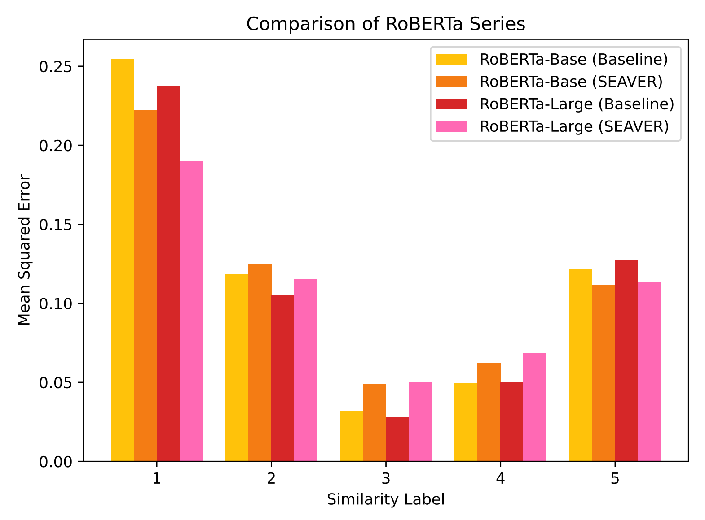
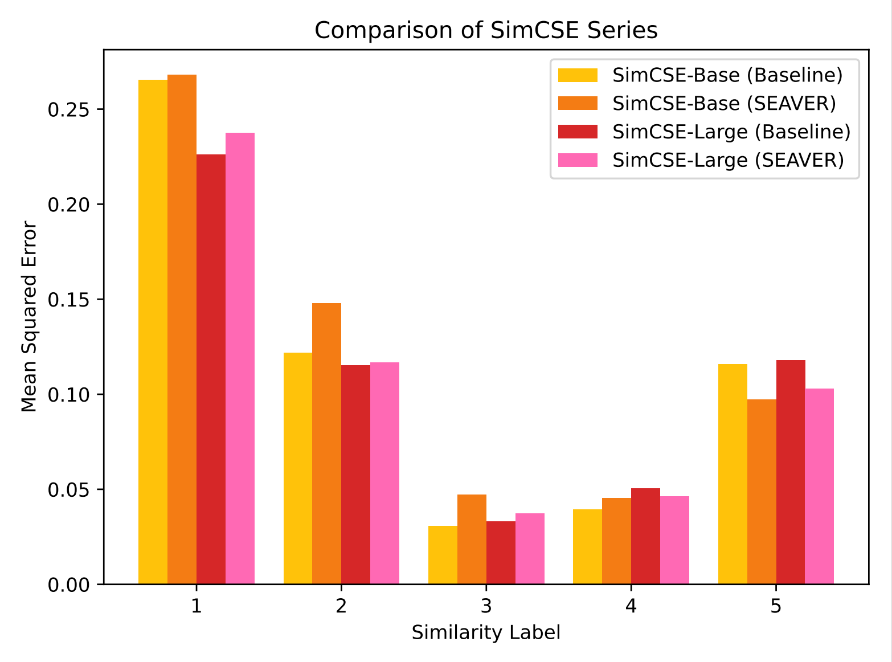

# 🕶️ <u>SE</u>lf-<u>A</u>ugmentation <u>V</u>ia S<u>E</u>lf-<u>R</u>eweighting (SEAVER)

This repository is the *Self-Augmentation via Self-Reweighting* (SEAVER) modified version of [the original C-STS models](https://github.com/princeton-nlp/c-sts) for better suiting the C-STS nature.

## 🔥📢 Supplementary Materials for the ARR-April Review



**Figure 1:** The performance of the RoBERTa series models on the C-STS-2023 validation set assessed by partitioning samples according to different similarity labels. The enhancement of RoBERTa with SEAVER showed a significant advantage in improving the model's predictive capability for labels 1 and 5, which represent more challenging similarity measurement tasks. However, for labels 2, 3, and 4—tasks that are relatively easier in terms of similarity measurement for the pre-trained + C-STS fine-tuned model—no significant improvement was observed. A more detailed analysis is provided in the author response section on OpenReview.



**Figure 2:** The performance of the SimCSE series models on the C-STS-2023 validation set assessed by partitioning samples according to different similarity labels. The enhancement of SimCSE with SEAVER showed a significant advantage in improving the model's predictive capability for label 5, which represents more challenging similarity measurement task. However, for labels 1, 2, 3, and 4—tasks that are relatively easier in terms of similarity measurement for the pre-trained + STS fine-tuned + C-STS fine-tuned model—no significant improvement was observed. A more detailed analysis is provided in the author response section on OpenReview.

## Fine-tuning

You can finetune the models described in the paper using the `run_sts.sh` script. For example, to finetune the `princeton-nlp/sup-simcse-roberta-base` model on the C-STS dataset, run the following command:

```bash
MODEL=princeton-nlp/sup-simcse-roberta-base \
ENCODER_TYPE=cross_encoder \
LR=3e-5 \
WD=0.1 \
TRANSFORM=True \
OBJECTIVE=mse \
OUTPUT_DIR=output \
TRAIN_FILE=data/csts_train.csv \
EVAL_FILE=data/csts_validation.csv \
TEST_FILE=data/csts_test.csv \
bash run_sts.sh
```

P.S. Because the method proposed in the article targets cross-encoding, it is necessary to set the `ENCODER_TYPE` to `cross_encoder` in this configuration.

See `run_sts.sh` for a full description of the available options and default values.

The number of epochs required to train various versions of the model to achieve optimal performance (on the C-STS validation set) are as follows:

|        Model (base-scale)         | (Optimal) Epochs |
| :-------------------------------: | :--------------: |
| SEAVER RoBERTa-base w/o original  |        6         |
| SEAVER RoBERTa-base w/ 1*original |        6         |
| SEAVER RoBERTa-base w/ 2*original |        6         |
| SEAVER RoBERTa-base w/ 3*original |        6         |
|  SEAVER SimCSE-base w/o original  |        6         |
| SEAVER SimCSE-base w/ 1*original  |        6         |
| SEAVER SimCSE-base w/ 2*original  |        6         |
| SEAVER SimCSE-base w/ 3*original  |        6         |

|        Model (large-scale)         | (Optimal) Epochs |
| :--------------------------------: | :--------------: |
| SEAVER RoBERTa-large w/o original  |        5         |
| SEAVER RoBERTa-large w/ 1*original |        6         |
| SEAVER RoBERTa-large w/ 2*original |        9         |
| SEAVER RoBERTa-large w/ 3*original |        8         |
|  SEAVER SimCSE-large w/o original  |        5         |
| SEAVER SimCSE-large w/ 1*original  |        6         |
| SEAVER SimCSE-large w/ 2*original  |        8         |
| SEAVER SimCSE-large w/ 3*original  |        11        |

P.S. It should be noted that in this case, a setting of `per_device_train_batch_size=16` along with `gradient_accumulation_steps=4` is used to achieve a training batch size of 64. The configurations of other hyperparameters are provided in the paper's Appendix. All experiments in our paper were conducted on a single RTX A5000.

P.P.S. When switching between the `base` and `large` models, as well as adjusting $\alpha$, be sure to modify the corresponding parameters in the `CrossEncoderForClassification` class within `\utils\sts\modeling_encoders.py`.

## Few-shot Prompting
This part is identical to the steps carried out in the original C-STS repository.

## Submitting Test Results

This section submits test results in accordance with the submission method stipulated by the C-STS dataset to prevent leakage of test set labels.

You can scores for your model on the test set by submitting your predictions using the `make_test_submission.py` script as follows:

```bash
python make_test_submission.py your_email@email.com /path/to/your/predictions.json
```

This script expects the test predictions file to be in the format generated automatically by the scripts above; i.e.

  ```json
  {
    "0": 1.0,
    "1": 0.0,
    "...":
    "4731": 0.5
  }
  ```

After submission your results will be emailed to the submitted email address with the relevant filename in the subject.

